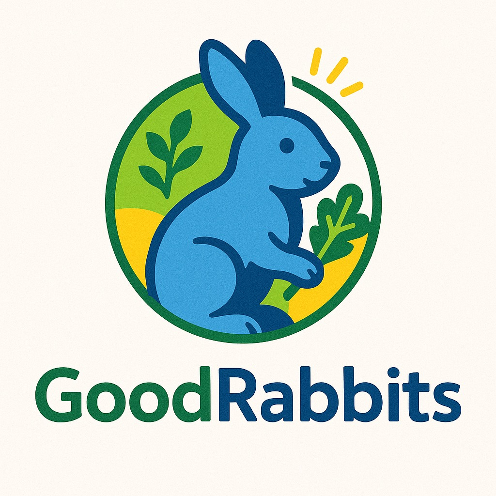

<!--  Change for a landscape one -->

 

<h1 align="center"> Good Rabbits - Gamified Health and Well-being</h1>
<h3>
<blockquote>
  “The important thing is not to live, but to live well.” ― Plato
</blockquote>
</h3>

 

Good Rabbits is a digital platform designed to promote health and well-being through the power of gamification. By turning healthy habits into engaging challenges, it motivates users to make lasting lifestyle changes in a fun, interactive environment.

Combining behavioral science with intuitive design, Good Rabbits offers personalized experiences that encourage consistency and reward progress. Whether for individuals or organizations, the platform provides a meaningful way to build healthier routines and promote long-term wellness.

 

<h2>Summary</h2>

* <a href="#installation-guide">Installation Guide</a>
* <a href="#features">Features</a>
* <a href="#technologies">Technologies</a>
* <a href="#documentation">Documentation</a>
* <a href="#license">License</a>
* <a href="#authors">Authors</a>

 

<h2 href="intallation-guide">Installation Guide</h2>

Prerequisites:

* NodeJS and NPM installed
* Have the project folder on your machine (via .zip or `git clone`)

 

Step by step:

* Copy in-place the `.env.example` files from both `backend` and `frontend` folders, rename to `.env` and modify as needed
* Open the project folder with the terminal
* Run the comands npm install && npm run build && npm run start

 

<h2 id="features">Features</h2>

* Gamefied experience
* Personalized journeys
* Data-Driven Insights
* Intuitive, responsive design 

 

<h2 href="technologies">Technologies</h2>

 

<h2 href="documentation">Documentation</h2>

Elements of the documentation include:

* Project description
* Pages design
* Installation guide
* ER diagram

 

<h2 href="license">License</h2>

This repository currently has no external licenses.

 

<h2 id="authors">Authors</h2>

* <a href="https://github.com/caramelPopp">Bárbara Fernandes Rampazi</a> (caramelPopp)
* <a href="https://github.com/neoRandom">Fellipe Leonardo Peixoto Cunha</a> (neoRandom)
* <a href="https://github.com/Gogfs">Gabriel Oliveira Gusmão Florencio dos Santos</a> (Gogfs)
* <a href="https://github.com/Gabits13">Gabriel Pereira dos Santos</a> (Gabits13)
* <a href="https://github.com/fantasma1234">Guilherme Pereira dos Santos</a> (Fantasma1234)
